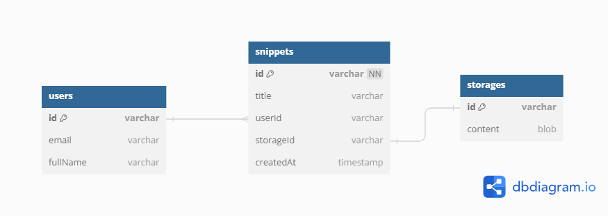
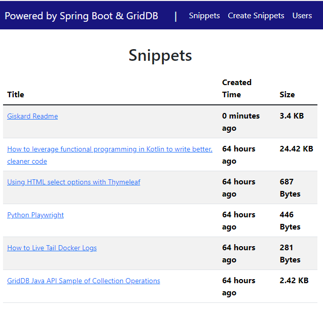
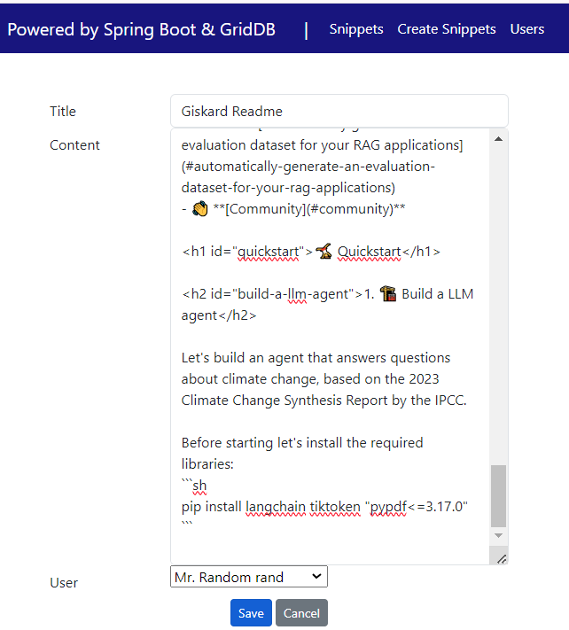

Building an Online Text Storage Service using Spring Boot: A Step-by-Step Guide for Developers
===


Have you ever needed to share a piece of code or text quickly and securely with someone else? With the growing need for easy-to-use online text storage solutions like Pastebin and GitHub Gist, developers are looking for efficient ways to store and share text files. In this blog post, we'll walk you through building your own online text storage service using Spring Boot. By following our step-by-step guide, you'll learn how to create a powerful and secure platform that allows users to store and share text files effortlessly. Whether you're a beginner or an experienced developer, this guide will equip you with the skills to build a robust text storage service.

We will start from the requirements, high-level design, and finally the implementation using Spring Boot with docker-compose.

### Requirements

#### ✅ We will have the following functional requirements:

1. Users enter text data into the system with the title
2. **User** clicks the snippet URL to view/edit the content
3. The system must generate a unique snippet ID

#### ❎ The out of scope:

* User management (register, login)
* User authentication and authorization
* User choose a custom ID

#### ☑️ The assumptions
* The system supports only text-based data
* The content does not expire
* The read-to-write ratio is around 5:1

#### ☑️ Capacity

On average, each snippet size is around 30 KB with a maximum size of 10 MB. With 10 million snippets per month, and each snippet requiring 30 KB of storage: 30/snippet * 1,000,000 snippets/month * 12 months = 3,600,000,000 KB/year, which is equivalent to 3.6 TB of storage per year.

## High Level Design

Typically, there are two methods for storing text content: utilizing object storage such as Amazon S3 and employing a database. This article streamlines the architecture by storing the text snippets directly within the database. Both the metadata and content are housed in the same database. This strategy enhances the speed of data retrieval. However, storing extensive text in this manner can escalate the database workload, potentially affecting performance as the data volume expands.

## Data Storage

We will use three tables. The first table, "users", stores information about registered users, like name and email.
The second table, named "snippets", stores information about the text metadata, like titles or creation dates, and the users who created it. Finally, the "storage" table is the vault where the actual text content of the user's entries is securely stored.
A user might create multiple snippets but a paste is owned only by a single user.




## Project Setup

### To get started developing you'll need to install the following softwares

- [Java 17 or later](https://jdk.java.net/21/), [Maven 3.5+](https://maven.apache.org/download.cgi), [Docker engine](https://docs.docker.com/engine/install/), and your favorite text editor ([Intellij IDEA](https://spring.io/guides/gs/intellij-idea/), or [VSCode](https://spring.io/guides/gs/guides-with-vscode/))

### Create a Spring Boot Project

Spring boot offers a fast way to build applications. 
Spring Boot does not generate code to make edits to your files. Instead, when you start your application, Spring Boot dynamically wires up beans and settings and applies them to your application context.
With Spring Boot, we can focus more on the business features and less on the infrastructure.

Navigate to [start.spring.io](https://start.spring.io/). This service pulls in all the dependencies you need for an application and does most of the setup. Click generate, it will generate the Spring Boot project and download it as a zip. Now unzip this project and import it into any IDE.<br>

To interact with GridDB, we need to add a GridDB Java Client to this project. Add the following dependency into maven `pom.xml`.

```xml
<dependency>
  <groupId>com.github.griddb</groupId>
  <artifactId>gridstore</artifactId>
  <version>5.5.0</version>
</dependency>
<dependency>
  <groupId>com.github.f4b6a3</groupId>
  <artifactId>tsid-creator</artifactId>
  <version>5.2.5</version>
</dependency>
```
<p>

## Building the Web Application

Based on practical considerations and familiarity, we choose Thymeleaf to render the frontend.\
Thymeleaf provides an easy-to-understand and easy-to-debug flow, making it a practical choice.\
Thymeleaf eliminates the need for additional package management, reducing complexity and potential vulnerabilities.

### The Front-End

Displaying a list of snippets, we define a basic HTML table structure with header and body sections.\
Inside the body, the code iterates through a list of snippets using a Thymeleaf loop (`th:each`).\
The first column shows the snippet title inside an anchor element to create a hyperlink to the snippet details.

```html
<div th:if="${snippets.size() > 0}" class="container">
    <table class="table table-hover table-responsive-xl table-striped">
        <thead class="thead-light">
            <tr>
                <th scope="col">Title</th>
                <th scope="col">Created Time</th>
                <th scope="col">Size</th>
            </tr>
        </thead>
        <tbody class="table-group-divider">
            <tr th:each="snippet : ${snippets}">
                <td>
                    <a class="small" th:href="@{/snippets/{id}(id=${snippet.id})}" th:text="${snippet.title}"></a>
                </td>
                <th id="timeAgo" scope="row">[[${snippet.timeAgo}]]</th>
                <th id="contentSizeHumanReadable" scope="row">[[${snippet.contentSizeHumanReadable}]]</th>                        
            </tr>
        </tbody>
    </table>
</div>
```

And this is what the listing page will look like:


<p>

Creating a new snippet by using html form. The `th:action` expression directs the form to POST to the `/snippets/save` endpoint. The `th:object="${snippet}"` declares the model object to use for collecting the form data.

```html
<form th:action="@{/snippets/save}" method="post" enctype="multipart/form-data" th:object="${snippet}"
  id="snippetForm" style="max-width: 550px; margin: 0 auto">

  <div class="p-3">
      <div class="form-group row">
          <label class="col-sm-3 col-form-label" for="title">Title</label>
          <div class="col-sm-9">
              <input type="text" th:field="*{title}" required minlength="2" maxlength="128"
                  class="form-control" id="title" />
          </div>
      </div>

      <div class="form-group row">
          <label class="col-sm-3 col-form-label" for="content">Content</label>
          <div class="col-sm-9">
              <textarea rows="20" cols="80" th:field="*{content}" form="snippetForm" class="form-control"
                  id="content" required/>
          </div>
      </div>

      <div class="form-group row">
          <label class="col-sm-3 col-form-label" for="userId">User</label>
          <div class="col-sm-9">
              <select th:field="*{userId}">
                  <option th:each="user : ${users}" th:text="${user.fullName}" th:value="${user.id}">
              </select>
          </div>
      </div>

      <div class="text-center">
          <input type="submit" value="Save" class="btn btn-primary btn-sm mr-2" />
          <input type="button" value="Cancel" id="btnCancel" class="btn btn-secondary btn-sm" />
      </div>
  </div>
</form>
```

And this is what the create snippet page will look like:


<p>

### Data access with GridDB

First, we create Java POJO classes that represent the underlying table or container in GridDB.
We annotate a class with Lombok @Data, which automatically generates getters for all fields, a useful toString method, and hashCode and equals implementations that check all non-transient fields. Also generate setters for all non-final fields, as well as a constructor.

We create the data access class according to the previous database design.
<p>

```java
@Data
public class User {
    @RowKey
    String id;
    String email;
    String fullName;
    Date createdAt;
}

@Data
public class Snippet {
    @RowKey
    String id;

    String title;
    String storageId;
    String userId;
    Date createdAt;
    String contentSizeHumanReadable;
}

@Data
public class Storage {
    @RowKey
    String id;

    Blob content;
}
```
<br>

Next, we create the `GridDBConfig` class as a central configuration for database operation.
The class will do the following:
* Read environment variables for connecting to the GridDB database
* Create a GridStore class for managing database connection to the GridDB instance
* Create GridDB Collection's container (Table) to manage a set of rows. The container is a rough equivalent of the table in a relational database.
* On creating/updating the Collection we specify the name and object corresponding to the column layout of the collection.
  Also for each collection, we add an index for a column that is frequently searched and used in the condition of the WHERE section of TQL.

```java
@Configuration
public class GridDBConfig {

  @Value("${GRIDDB_NOTIFICATION_MEMBER}")
  private String notificationMember;

  @Value("${GRIDDB_CLUSTER_NAME}")
  private String clusterName;

  @Value("${GRIDDB_USER}")
  private String user;

  @Value("${GRIDDB_PASSWORD}")
  private String password;

  @Bean
  public GridStore gridStore() throws GSException {
    // Acquiring a GridStore instance
    Properties properties = new Properties();
    properties.setProperty("notificationMember", notificationMember);
    properties.setProperty("clusterName", clusterName);
    properties.setProperty("user", user);
    properties.setProperty("password", password);
    GridStore store = GridStoreFactory.getInstance().getGridStore(properties);
    return store;
  }

    @Bean
    public Collection<String, User> userCollection(GridStore gridStore) throws GSException {
        Collection<String, User> collection = gridStore.putCollection("users", User.class);
        collection.createIndex("email");
        return collection;
    }

    @Bean
    public Collection<String, Snippet> snippetCollection(GridStore gridStore) throws GSException {
        Collection<String, Snippet> snippetCollection =
                gridStore.putCollection(AppConstant.SNIPPETS_CONTAINER, Snippet.class);
        snippetCollection.createIndex("userId");
        snippetCollection.createIndex("title");
        return snippetCollection;
    }

    @Bean
    public Collection<String, Storage> storageCollection(GridStore gridStore) throws GSException {
        Collection<String, Storage> storageCollection =
                gridStore.putCollection(AppConstant.STORAGES_CONTAINER, Storage.class);
        return storageCollection;
    }
}
```
<br>

### The Service Layer

In the Spring framework, the Service Layer is one of the fundamental architectural layers, primarily responsible for implementing the business logic of an application.

#### `SnippetService`

Method `fetchAll` : query all the snippets from the collection order by newly created first.

Method `create`:
* Is responsible for storing the snippet content in the storage collections, and saving the metadata of the new snippet.
* Calculate the size of the content and save that info in a human-readable format.
* Generate a snippet ID that is non-predictable, collision-free, and should be readable.
* We choose Time-Sorted Unique Identifiers (TSID) as the ID of the snippet. By using TSID, we get a time-sorted identifier including a random component, and can be represented as a 13-character string.


```java
@Service
@RequiredArgsConstructor
public class SnippetService {
    private final Logger log = LoggerFactory.getLogger(SnippetService.class);
    private final Collection<String, Snippet> snippetCollection;
    private final Collection<String, Storage> storagCollection;

    public List<Snippet> fetchAll() {
        List<Snippet> snippets = new ArrayList<>(0);
        try {
            String tql = "SELECT * FROM " + AppConstant.SNIPPETS_CONTAINER + " ORDER BY createdAt DESC";
            Query<Snippet> query = snippetCollection.query(tql);
            RowSet<Snippet> rowSet = query.fetch();
            while (rowSet.hasNext()) {
                snippets.add(rowSet.next());
            }
        } catch (GSException e) {
            log.error("Error fetch all snippet", e);
        }
        return snippets;
    }

    public void create(CreateSnippet createSnippet) {
        try {
            Snippet found = fetchOneByTitle(createSnippet.getTitle());
            if (found != null) {
                return;
            }
            Blob content = snippetCollection.createBlob();
            content.setBytes(1, createSnippet.getContent().getBytes());
            Storage storage = new Storage();
            storage.setId(KeyGenerator.next("obj"));
            storage.setContent(content);
            storagCollection.put(storage.getId(), storage);
            Snippet snippet = new Snippet();
            snippet.setTitle(createSnippet.getTitle());
            snippet.setStorageId(storage.getId());
            snippet.setUserId(createSnippet.getUserId());
            snippet.setCreatedAt(new Date());
            snippet.setContentSizeHumanReadable(toHumanReadableByNumOfLeadingZeros(
                    createSnippet.getContent().getBytes().length));
            snippetCollection.put(KeyGenerator.next("sn"), snippet);
        } catch (GSException e) {
            e.printStackTrace();
        } catch (SQLException e) {
            e.printStackTrace();
        }
    }
}
```

### The Controller Layer

This layer is responsible for handling incoming HTTP requests. The controller will receive requests, process them, and interact with the previous service layer to retrieve or manipulate data.

The `SnippetsController` handles all HTTP request to `/snippets`.

```java
@Controller
@RequestMapping("/snippets")
@RequiredArgsConstructor
public class SnippetsController {
    private static final Logger log = LoggerFactory.getLogger(SnippetsController.class);
    private final SnippetService snippetService;
    private final UserService userService;

    @GetMapping
    String snippets(Model model) {
        List<Snippet> snippets = snippetService.fetchAll();
        List<SnippetView> snippetViews = snippets.stream()
                .map(sn -> SnippetView.builder()
                        .id(sn.getId())
                        .title(sn.getTitle())
                        .createdAt(sn.getCreatedAt())
                        .timeAgo(calculateTimeAgoByTimeGranularity(sn.getCreatedAt(), TimeGranularity.MINUTES))
                        .contentSizeHumanReadable(sn.getContentSizeHumanReadable())
                        .build())
                .collect(Collectors.toList());

        List<User> users = userService.fetchAll();
        model.addAttribute("snippets", snippetViews);
        return "snippets";
    }

    @GetMapping("/new")
    String newSnippet(Model model) {
        List<User> users = userService.fetchAll();
        model.addAttribute("snippet", new CreateSnippet());
        model.addAttribute("users", users);
        return "new_snippet";
    }

    @PostMapping("/save")
    String saveSnippet(@ModelAttribute("snippet") CreateSnippet createSnippet) {
        snippetService.create(createSnippet);
        return "redirect:/snippets";
    }
}
```


Method `snippets(Model model)`:
* Handle GET request to URL `/snippets`
* Call the service layer to get a list of snippets
* Format the creation time into time ago format for each snippet
* Return a `View` (in this case, `snippets`) for rendering HTML content of snippet list

Method `newSnippet(Model model)`:
* Handle GET request to URL `/snippets/new`.
* Use a `Model` object to expose a new Snippet (`CreateSnippet`) to the view template. `CreateSnippet` contains fields such as `title` and `content`.
* Call the service layer to save the Snippet data


### Running the Project with Docker Compose

To spin up the project we will utilize Docker, a popular container engine.\
First, build the docker image using the following command:
```bash
  docker compose -f docker-compose-dev.yml build
```

Run the app:
```bash
  docker compose -f docker-compose-dev.yml up
```

Upon successful execution of the command, you can access the website at http://localhost:8080.

## Conclusion

In conclusion, creating a basic online text storage service using Java Spring Boot and GridDB is a simple and effective process. Spring Boot allows us to concentrate on our core development tasks, while Thymeleaf speeds up template prototyping by not requiring a back-end initially. GridDB efficiently handles the storage of text content using the blob data type.

To take your service to the next level, consider adding data compression to save on database storage, building metrics to track the viewer count of each text snippet, and encryptions. By implementing these enhancements, you can turn a basic service into a powerful and feature-rich platform.\
Keep learning and building.
> The entire code for this web application is available on [Github](https://github.com/alifruliarso?tab=repositories).